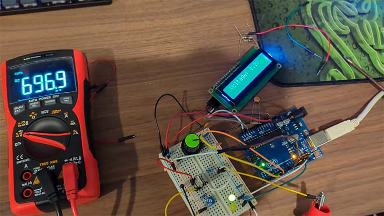
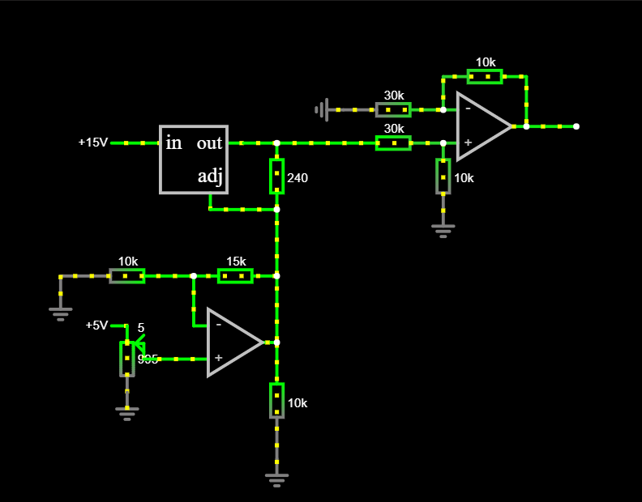
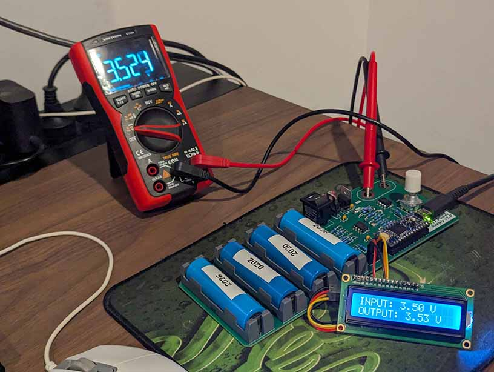

# Overview

This project focused on developing a step-down voltage regulator based around the LM317T linear voltage regulator, to generate and ouput voltage of 2.5-15 Volts.

The system is powered by four 18650 Li-ion batteries and is controlled by a master rocker switch. To set the output, the user interacts with a rotary encoder, which provides input signals to an Arduino R4. The Arduino then translates these movements into commands for a digital potentiometer. This potentiometer works within a voltage divider and op-amp circuit to manipulate the voltage on the adjust pin of an LM317T regulator, effectively setting the final output. To ensure precision, an op-amp steps the output voltage down and feeds it back into the R4, creating a closed feedback loop that allows the microcontroller to monitor and accurately maintain the desired regulation.

# Components

An overview of the main components used in the project:

- [LM317T](https://au.mouser.com/ProductDetail/511-LM317T) used to regulate +VBAT to +VOUT.
- [L4941BV](https://au.mouser.com/ProductDetail/511-L4941BV) to regulate a stable 5V.
- [MCP4162-502E/P](https://au.mouser.com/ProductDetail/Microchip-Technology/MCP4162-502E-P?qs=hH%252BOa0VZEiDDRVodHevOyA%3D%3D) to vary the LM317T adjust voltage level.
- [LM358P](https://au.mouser.com/ProductDetail/595-LM358P) To step up and step down voltages (non-inverting).
- [Arduino Nano Rev4](https://au.mouser.com/ProductDetail/782-ABX00142) as the microcontroller.
- [EN11-HSM1AF20](https://au.mouser.com/ProductDetail/858-EN11-HSM1AF20) as a user interface component to control desired output voltage.

See the project file for the complete Bill of Materials.

# Development

## Prototyping

The system was first prototyped on a breadboard, verifying that a closed feedback loop was possible and that the output voltage can be varied. This was achieved using hobby components from my local electronics store.



Following this, the system was modelled in [Falstad](https://www.falstad.com/circuit/). I was able to vary inputs and tune parameters to match expected outputs.



## PCB

The simulated circuit was converted into a schematic in Altium Designer and synthesised into a PCB. The board used through-hole components rather than SMD/SMT because I did not have access to reflow equipment. You can see the schematic in either the project [.zip file](./Linear%20Power%20Supply.zip) or the [.pdf here](Images/Schematic.pdf).



### Errors & Modifications

This project was developed on a short timeline, so some errors prevailed.

- I selected a digital rheostat instead of a potentiometer, so I soldered an external pull-down resistor to complete the voltage divider.
- The LM358P operational amplifier had a top-rail voltage of 5 V, meaning the output voltage of the board was limited to 6.25 V.

## Feedback Control

The most critical part of achieving an accurate output focuses on the control system. Component tolerances and properties means the hardware will always perform differently than the simulations, meaning the system could output 5.3 V when you really want it to output 5.0 V. A feedback loop allows the board to identify this error and automatically correct it.

I employed a gradient-descent optimisation method to converge on the best output voltage. The R4 calculated the error between its set voltage and current output and steps in the right direction proportional to the error's modulus. This stepping continues until it eventually overshoots the target, where it will resume the previous value (saddle point).

The following figure compares three different feedback systems:

- **No feedback control (Blue)** | Calculating the potentiometer resistance and sending the signal, no verification.
- **Converging to a set range (Orange)** | Converging to a fixed error range i.e., continue stepping until error less than 100 mV. Digital potentiometer limited to 128 steps.
- **Feedback with 256 steps (Gray)** | Converging to saddle point, with 256 steps (used method).

The no feedback system had the worst error, with the 128 steps averaging 80 mV of absolute error, and the 256 step method average 18 mV of error.


# Results

The project was a success, and within its output range of 2.5 - 6.0 V, it was able to regulate the output voltage consistently within 50 mV of error, with best-case scenarios with 0-5 mV of error (average error of 18 mV). The system converges to a stable output in a fraction of a second, making the system very easy to interface with.

This project served as a stepping stone for more complex electrical projects. I was able to learn more about closed-feedback systems and develop a precise and accurate system with budget components. It's always exciting to see what can be done with hobby-components.

# Future Suggestions

If this project were to be revised, I would:

- Add board cut-outs underneath the battery holders so it is easier to remove the batteries.
- Allow the board to operate with at least 2 batteries inserted, instead of needing all four to complete the circuit.
- Add surge/ESD protection or fuses for worst-case coverage.
- Add mounting holes so a case can be printed and attached.
- Add 0.1inch headers so it can be breadboard compatible.

To add to the project scope and make it more than just a step-down regulator, I could:

- Add fuel gauge ICs to track how much charge each battery has.
- Add battery charging so the batteries don't need to be removed and charged externally.

# Repository File Structure

```
Power-Supply/
├── .gitignore
├── README.md
├── Data.xlsx // Gathered Data
├── Linear Power Supply.zip // Altium Project File
├── Arduino/
│   └── Arduino.ino // Code for Nano R4
└── Images/
    └── Breadboard.png
    └── Falstad.png
    └── Feedback Error.png
    └── PCB.png
    └── Schematic.pdf // Altium Schematic
```